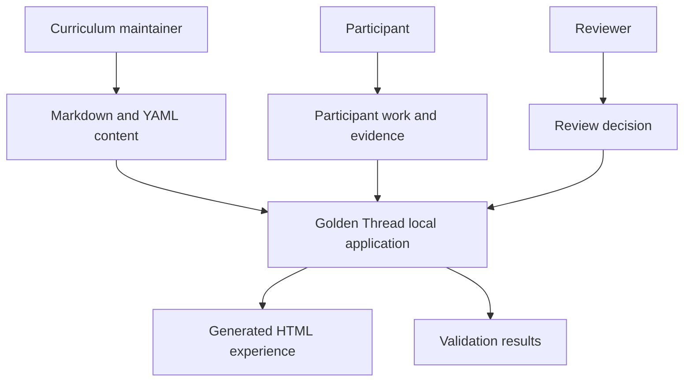
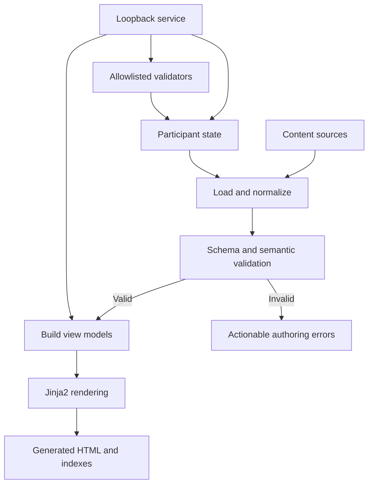
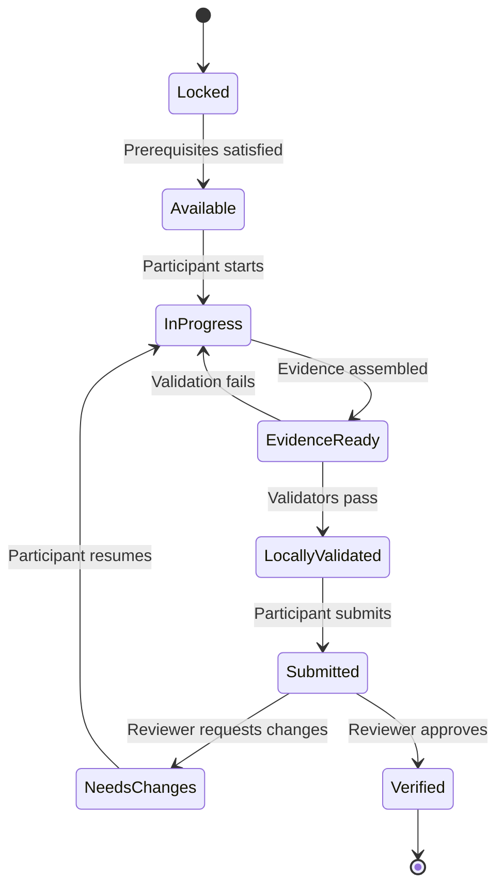

# Architecture

## Architectural goal

Build a local-first, repository-native training application in which curriculum content, participant work, evidence, and review decisions remain ordinary inspectable files. The application presents and validates those files without becoming their exclusive owner.

## System context



## Build and runtime flow



## Production repository structure

Claude should evolve this design package into this target structure without moving participant-owned data into application code.

```text
golden-thread-quest/
├── content/                 # Program-authored curriculum
│   ├── quests/
│   ├── regions/
│   ├── badges/
│   ├── tracks/
│   ├── glossary/
│   └── site.yaml
├── schemas/                 # Public data contracts
├── templates/               # Jinja2 presentation only
│   ├── layouts/
│   ├── pages/
│   └── components/
├── assets/                  # CSS, limited JS, icons, local fonts if licensed
├── quest_app/               # Python application
│   ├── build.py
│   ├── serve.py
│   ├── content_loader.py
│   ├── models.py
│   ├── view_models.py
│   ├── progress_manager.py
│   ├── validator_registry.py
│   ├── validator_runner.py
│   └── git_status.py
├── validators/              # Registered validator definitions and code
├── tests/                   # Unit, contract, integration, UI, and security tests
├── participant/             # Participant-owned and committed
│   ├── PROFILE.md
│   ├── QUEST-PASSPORT.md
│   ├── QUEST-LOG.md
│   ├── progress.yaml
│   ├── skills/
│   ├── scripts/
│   ├── tests/
│   ├── context/
│   └── evidence/
├── generated/               # Reproducible; Gitignored
├── local-data/              # Cache/runtime/raw private data; Gitignored
├── docs/
└── pyproject.toml
```

## Ownership boundaries

### Program-owned

The canonical upstream may update:

- `content/`
- `schemas/`
- `templates/`
- `assets/`
- `quest_app/`
- `validators/`
- most of `docs/`

### Participant-owned

The participant owns everything under `participant/`. Application actions may modify these files only through documented, narrow operations. Upstream merge and migration tools must never replace them wholesale.

### Machine-owned

Everything under `generated/` and `local-data/` is disposable. A clean build can recreate required generated output without network access.

## Build pipeline

The builder performs these steps in this order:

1. Discover content files using configured content roots.
2. Parse YAML and Markdown front matter safely.
3. Validate every document against its JSON Schema.
4. Apply semantic validation across documents.
5. Load participant state and validate it separately.
6. Compute prerequisites, quest states, progress totals, earned XP, verified XP, and badges.
7. Produce stable normalized view models.
8. Render pages with Jinja2.
9. Produce search, tag, region, and relationship indexes.
10. Copy fingerprinted or versioned static assets.
11. Emit a build manifest containing input hashes and application version.
12. Write output atomically so a failed build does not leave a partial site.

## Semantic validation

JSON Schema is necessary but insufficient. The build must also reject:

- duplicate stable IDs;
- nonexistent region, track, badge, prerequisite, validator, or quest references;
- circular quest prerequisites;
- invalid status transitions;
- duplicate proof IDs within one quest;
- validator paths outside approved roots;
- unsupported schema or content versions;
- negative XP or invalid level values;
- verified state without a qualifying review decision;
- attempts that reference a future or unavailable quest version.

Warnings should cover unreachable quests, regions with no quests, badges with impossible criteria, and deprecated fields.

## Local service

The local service exists only to provide capabilities static HTML cannot safely perform.

### Allowed responsibilities

- Return current application and environment health.
- Start a quest attempt.
- Update participant-owned narrative fields.
- Create an evidence directory from a known template.
- Run a registered validator with validated parameters.
- Return Git status for approved repository paths.
- Rebuild generated pages after approved state changes.
- Prepare a submission summary and branch/PR instructions.

### Forbidden responsibilities

- Execute caller-provided shell strings.
- Read or write arbitrary paths.
- Store external credentials.
- Push, merge, or force-update Git branches without an explicit command outside the UI.
- Automatically mark work verified.
- Make external Jira, Trello, GitHub, or other write operations merely because a page was opened.
- Upload evidence or telemetry by default.

### Binding and request protection

- Bind to `127.0.0.1`, never `0.0.0.0`, by default.
- Use an unguessable per-run token for state-changing requests.
- Validate origin and content type for state-changing requests.
- Set strict request-size limits.
- Use allowlisted enumerations rather than accepting raw paths or commands.
- Record participant-visible audit entries for mutations.

## Page generation strategy

Generate a page per stable entity where appropriate:

- `/index.html`
- `/map/index.html`
- `/catalog/index.html`
- `/regions/{region-id}/index.html`
- `/quests/{quest-id}/index.html`
- `/evidence/{quest-id}/index.html`
- `/passport/index.html`
- `/health/index.html`
- `/review/{quest-id}/index.html`

Links use generated route helpers. Content files must never store output-relative HTML paths.

## State transition model



An approved policy may permit submission with advisory validator failures, but the UI must display the exception and reason. A participant cannot write a `verified` state directly.

## Upstream update strategy

The participant fork uses:

- `origin` for the participant's fork;
- `upstream` for the canonical quest repository.

A future `quest update` helper may:

1. Refuse to operate on a dirty working tree unless an explicit safe override exists.
2. Fetch upstream.
3. Display release and migration notes.
4. Create a backup branch.
5. Merge or rebase according to documented policy.
6. Apply versioned state migrations.
7. Validate participant state and content.
8. Never replace `participant/` wholesale.

## Failure handling

- Content errors identify file, field, received value, expected constraint, and suggested correction.
- Validator failures distinguish participant failure, environment failure, validator defect, and inconclusive result where possible.
- State writes use lock-and-replace or equivalent atomic behavior.
- The application preserves the last known valid generated site after a failed rebuild.
- Interrupted validator execution produces an explicit incomplete result rather than a false pass or fail.
- Application restart recovers from persisted participant state, not browser local storage.

## Testing layers

- Unit tests for parsing, calculations, route helpers, and transition rules.
- Contract tests for every schema and example.
- Semantic-validation tests including cycles and broken references.
- Golden/snapshot tests for normalized view models and selected rendered fragments.
- Integration tests for build, state update, validator run, and rebuild.
- Playwright tests for primary participant and reviewer flows.
- Security tests for path traversal, command injection, origin checks, token requirements, and secret redaction.
- Accessibility checks plus manual keyboard and screen-reader-oriented review.
