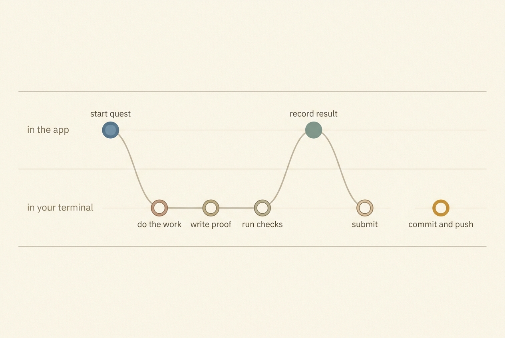
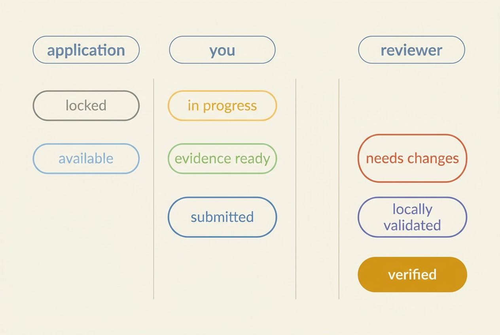
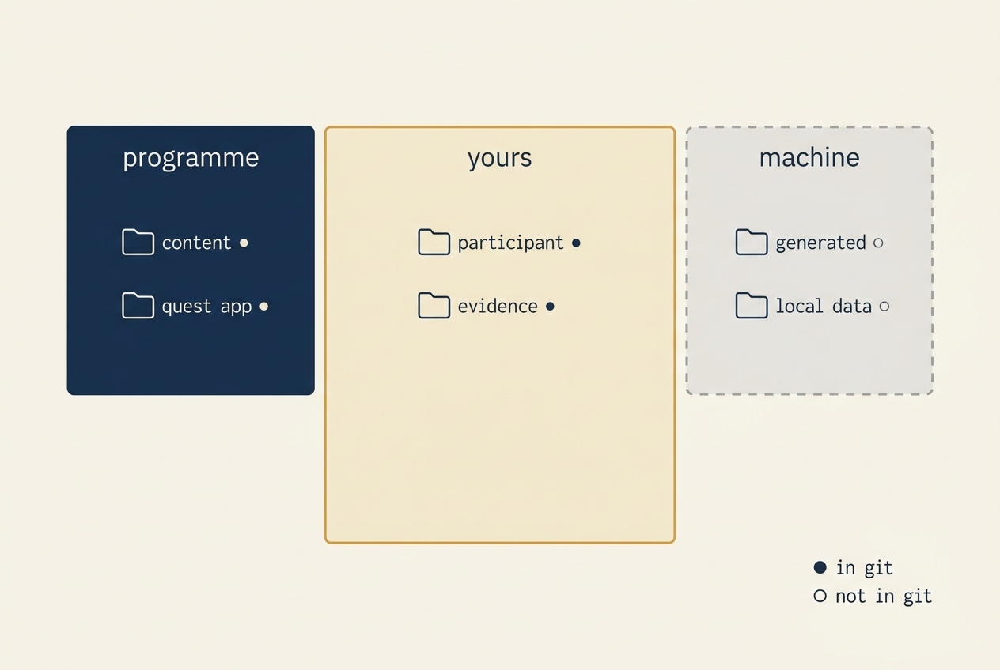
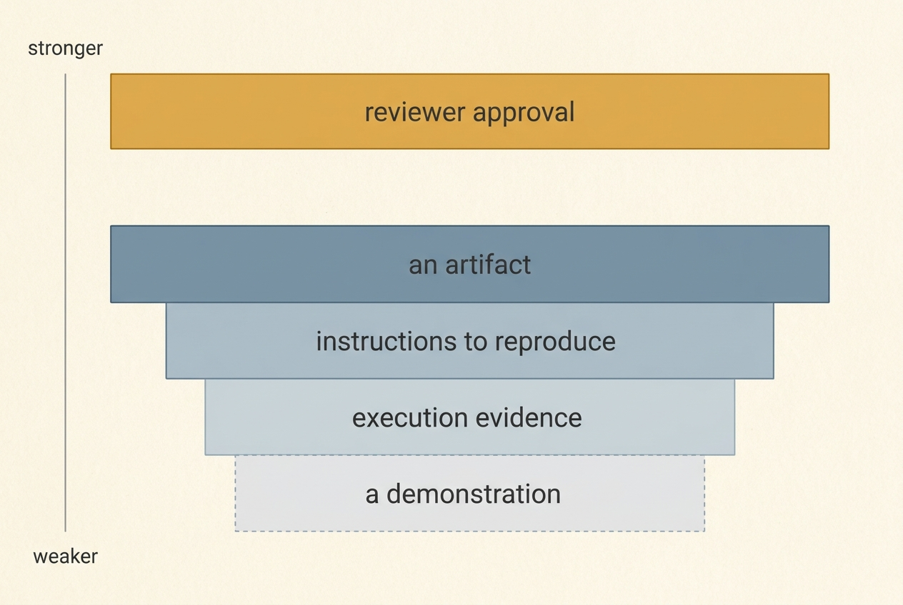
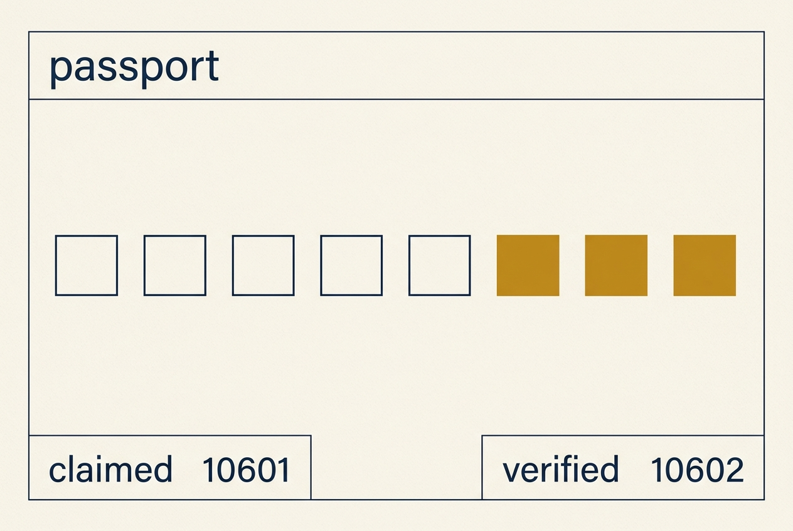

# The Golden Thread Quest — User Guide

You are doing this on your own, remotely, probably without anyone to ask. This guide assumes
that. It tells you what to install, what to do, what each thing means, what to do when
something goes wrong, and what "finished" actually looks like.

Read the first three sections before you start. The rest is reference.

---

## 1. What this actually is

A training program you work through in your own Git repository, on your own machine.

Most training either gives you videos or grades a quiz. This does neither. You do real work
— synchronize a Jira board, write a test, normalize a transcript into context an agent can
use — and you leave behind **evidence**: files, commands someone else can run, results from
automated checks. A human reviewer reads that evidence and decides whether it demonstrates
what the quest asked for.

Two things follow from that, and they shape everything else:

**Your work is files, not database rows.** Everything you produce lives under `participant/`
in your own repository. You can read it, edit it, commit it, and take it with you. If you
stopped using this application tomorrow, your portfolio would still be there and still make
sense.

**Nothing you do makes work "verified".** You can mark your own evidence ready. Automated
checks can pass. Neither produces verified completion — only a reviewer's approval does. That
is deliberate, and the application enforces it rather than trusting it.

---

## 2. Install it

### What you need

| | |
|---|---|
| Python | 3.12 or newer |
| [uv](https://docs.astral.sh/uv/) | any recent version |
| Git | 2.30 or newer |
| A browser | anything current |

Nothing else. No database, no Docker, no account, no network connection after install.

### Do this

```bash
git clone <your fork of the quest repository> golden-thread-quest
cd golden-thread-quest
make setup
source .venv/bin/activate
```

Then prove it works:

```bash
make check
```

That runs formatting, linting, type checking, a YAML-safety rule, a secret scan and 486
tests. It takes about a minute and works entirely offline. If it passes, your installation is
sound. If it does not, go to [Section 9](#9-when-something-goes-wrong).

### Start it

```bash
make serve
```

It builds the site, starts a service bound to `127.0.0.1` only, and prints an address. Open
that address in your browser.

**Leave it running while you work.** Reading works without it; changing anything does not.

---

## 3. Your first hour



1. **Open the home page.** It shows one recommended quest and says why, in three sentences.
   The recommendation is calculated, not guessed — it will be the same tomorrow given the same
   inputs.

2. **Read the whole quest page before starting.** Especially *How this is judged* — those
   criteria are numbered, and a reviewer's findings will refer to them by number.

3. **Press Start quest.** Three things happen:
   - `participant/progress.yaml` is created if it did not exist
   - an evidence package appears at `participant/evidence/<quest-id>/<attempt-id>/`
   - a line is added to `participant/ACTIVITY.md` saying what was done

4. **Do the work in your repository.** Not in the browser. The application is where you read
   the brief and record what happened; your editor and terminal are where the work happens.

5. **Fill in `PROOF.md`.** It is a template with the questions a reviewer will ask. Answer
   them.

6. **Run the checks.** Each one tells you what it looked at and what it found.

7. **Mark evidence ready**, then **Record local validation**, then **Submit for review**.

8. **Commit and push.** The application prints the commands and runs none of them.

---

## 4. The eight states, and who sets each one

This is the part worth understanding properly, because the whole product turns on it.

| State | Set by | Means |
|---|---|---|
| **Locked** | The application | A prerequisite is not verified yet |
| **Available** | The application | You can start |
| **In progress** | **You** | You started |
| **Evidence ready** | **You** | You assert the proof is assembled |
| **Locally validated** | **You**, backed by checks | You ran the required checks and they qualify |
| **Submitted for review** | **You** | You asked a reviewer to decide |
| **Needs changes** | **A reviewer** | Corrections required; your evidence is untouched |
| **Verified** | **A reviewer** | Approved |



Two totals appear everywhere and are **never added together**:

- **Claimed XP** — your own record of what you finished.
- **Verified XP** — awarded only by a reviewer approving your evidence.

A passing check is not approval. `inconclusive` is not a pass — it means the check could not
tell, which is not evidence either way. A *failing* check is not a failed quest; it tells you
what to fix and changes nothing.

> **Why this matters to you.** When you show this to an employer or a lead, "verified"
> means a named person read your evidence and said it held up. That is worth something
> precisely because you could not award it to yourself.

---

## 5. Working alone: how to not get stuck

You have no one to ask. These are the things that unstick people.

**Read the acceptance criteria first, and again before you submit.** They are numbered and
they are the standard you will be judged against. If you cannot point at the evidence that
satisfies criterion 4, you are not ready to submit.

**Write `PROOF.md` as you go, not at the end.** It asks what you built, where the artifacts
are, how to reproduce the behavior, what you validated, and what limitations remain. Writing
it last means reconstructing it; writing it as you go means it is true.

**A reviewer should not have to hunt.** Repository-relative paths, exact commands, and say
what you could *not* get working. Naming a limitation is a strength — it is the difference
between someone who finished and someone who understands what they finished.

**When a check fails, read the finding, not just the outcome.** Each one says what it
evaluated, what it observed, and what to do. They are ordered with the most serious first.

**If you are stuck for more than an hour**, do the smallest honest thing: write down in
`PROOF.md` exactly where you got to and what you tried, mark the evidence ready, and submit.
A reviewer asking for changes with a concrete finding is worth more than another hour alone.

**Commit often.** Your work is in Git. `git status`, `git stash list` and `git reflog` have
recovered more work than any backup.

---

## 6. What the application writes, and what it never does



**Inside `participant/`, only these, only through documented actions:**

- `progress.yaml` — your state. Written atomically and validated before it lands, so an
  interrupted save cannot leave it broken.
- `evidence/**` — your evidence packages, validation results, submission and review records.
- `ACTIVITY.md` — one line per change the application made, for you to read.

**It also rewrites `generated/`** on every action. That is machine-owned, gitignored and
disposable; `make build` recreates it.

**It never:** commits, pushes, merges, rebases, cleans, or opens a pull request. It never
writes outside `participant/`. `make clean` removes generated output and refuses to touch
anything of yours — there is a test that proves it.

**It never sends anything anywhere.** No telemetry, no accounts, no remote requests. The
generated pages load no remote script, font or image.

---

## 7. Evidence that holds up



Preferred, strongest first:

1. **A repository artifact** — code, a test, a config, a normalized context file.
2. **Reproducible instructions** — exact commands, ideally from a clean clone.
3. **Automated execution evidence** — a validation result, a test run, a log.
4. **A demonstration** — you walking someone through it.
5. **A reviewer's approval.**

Screenshots support the others; they are not the proof. A screenshot shows something
happened once on your machine. A command someone else can run shows it happens.

**Never put a secret in evidence.** The application scans before you can mark evidence ready
or submit, and refuses if it finds one — it reports the file and line and never the value.
That scan is a safety net, not a guarantee. Credentials belong in your environment or an
authenticated CLI, never in a file you commit.

---

## 8. Getting reviewed

Submitting captures a fingerprint of your evidence at that moment. If you change it
afterwards, the reviewer is told — and they cannot approve changed evidence without explicitly
acknowledging they have re-read it.

**To approve, a reviewer must write a verification statement** in their own words saying what
they checked and how. **To ask for changes, they must record at least one finding.** A
decision you cannot act on is not allowed.

**If you get "needs changes":** your evidence is preserved exactly as it was. Read the
findings, resume the quest, address them, and resubmit. This is the normal path, not a
failure.

**One limitation, stated plainly:** this release identifies a reviewer by the name in the
record and by Git history. Review records are not cryptographically signed. If your program
needs stronger proof of who approved what, review through pull requests so the Git history
carries the identity. `docs/guides/REVIEWER.md` says the same thing to reviewers.

---

## 9. When something goes wrong

| Symptom | What it means | What to do |
|---|---|---|
| An action is refused | The page says so at the top, in red, with the reason. Nothing changed | Fix what the reason names, try again |
| `make setup` cannot find uv | uv is not installed | Install from <https://docs.astral.sh/uv/>, or `python3 -m venv .venv && .venv/bin/pip install -e ".[dev]"` |
| The build fails and you cannot tell why | Content does not validate, so nothing was published | `make validate-content` prints file, field and a suggested fix. A failed `make build` also writes `local-data/build-errors/index.html` |
| `make serve` refuses to start | You passed a bind address that is not loopback | It binds to `127.0.0.1` only, by design. Drop the `--host` |
| "only possible from…" | The transition is not legal from your current state | The message names the states it *is* legal from |
| A check says `inconclusive` | It could not tell — not a failure | The finding says what was missing |
| The site looks unstyled from disk | You opened `generated/index.html` instead of using `make serve` | Use `make serve`. Reading from disk works; controls do not |
| Buttons do nothing | The service is not running, or you are on a stale page | Check `make serve` is up, then reload |
| Your work seems lost | It is in Git | `git status`, `git stash list`, `git reflog` |

Two commands worth remembering:

```bash
make validate-content   # is my content and state consistent?
make check              # is my whole installation sound?
```

---

## 10. Taking curriculum updates

```bash
make update-check
```

It tells you whether it is safe and prints the commands. **It runs no merge** — merging on
your repository with your uncommitted work in it is not a decision an application should make.

A dirty working tree is a hard stop, not a warning. The printed sequence creates a backup
branch first, so there is always one command that puts everything back.

**Your in-progress attempts stay on the quest version you started.** If a quest moves from
version 2 to 3 while you are working, you keep working against version 2 and the page tells
you a newer one exists. **Verified work stays verified** — a new version does not revoke an
approval.

Full detail: `docs/guides/UPDATING.md`.

---

## 11. Knowing when you are finished

There is no completion certificate, and that is the point. What you have at the end is:

- a **passport** showing verified capability by region, with claimed and verified kept apart;
- a **repository** of real artifacts, reproducible instructions and validation results;
- a **review history** of named people saying your evidence held up.

That is the thing you show someone. It is worth more than a score because none of it is
self-assessed.



---

## 12. Known limitations

Read these before you rely on the application for anything that matters. The full list, with
reasons, is in `docs/RELEASE-NOTES.md`.

1. **Reviewer identity is conventional, not cryptographic.** See Section 8.
2. **Recording a decision needs the local service running.** Reading evidence does not.
3. **Reviewer-awarded badges cannot be awarded yet.** Meeting the criteria shows "pending";
   there is no badge-award record type in this release. Granting one by arithmetic would be
   exactly the blurring of authority the product exists to prevent.
4. **Environment Health reports what was true at build time**, not live.
5. **Validator isolation is policy plus process boundaries**, not a container. A validator is
   program-owned and reviewed like code; it is not sandboxed against a hostile author.
6. **Catalog filtering needs JavaScript.** Region and tag pages work without it.
7. **The secret scanner is a safety net**, not a guarantee. It will not catch every shape.
8. **Clean-clone installation is not automatically tested.** It is the one acceptance
   criterion without a test, and it is named as such in `docs/TRACEABILITY.md`.

---

## 13. Where to go next

| You want | Read |
|---|---|
| To review someone else's evidence | `docs/guides/REVIEWER.md` |
| To write an automated check | `docs/guides/VALIDATOR-AUTHORING.md` |
| To write a quest | `docs/CONTENT-AUTHORING-GUIDE.md` |
| To take upstream changes | `docs/guides/UPDATING.md` |
| To know what was built and why | `docs/IMPLEMENTATION-DETAILS.md` |
| To see what was found and fixed | `docs/audits/` |
