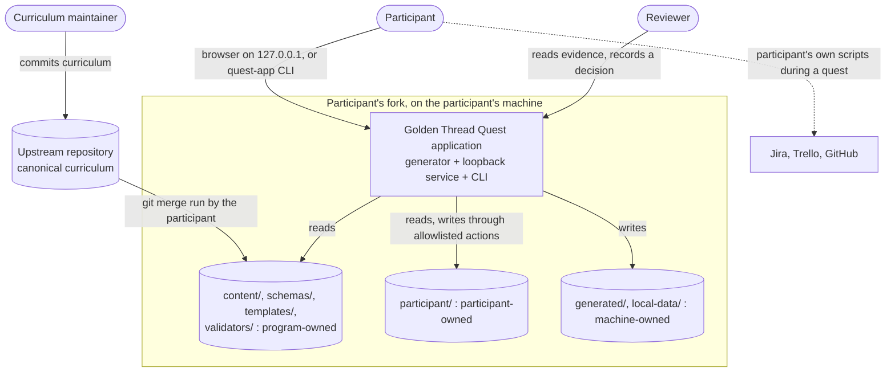

# Part 1. Purpose and users

This part explains the problem the application solves, who uses it, and the one boundary
that shapes every later design choice: who owns which files.

## 1.1 The problem

The Golden Thread Quest trains an **AI Context Engineer**: a person who owns the two ends of
software delivery that agentic tools touch most.

- The **intent bookend**: capturing conversations, decisions and requirements, structuring
  them as local context, and turning them into actionable work items.
- The **validation bookend**: turning that intent into tests, running them, keeping
  evidence, and saying what risk remains.

The "golden thread" is the traceable line between the two:

> Conversation → requirement → work item → implementation → test → evidence → outcome

Training for this role has a specific difficulty. The skills are practical, so a quiz proves
little. The work happens in real repositories with real tools, so a hosted course cannot see
it. And the most important question a mentor asks, "did this person actually do it, and does
it hold up?", needs a human judgment backed by evidence, not a checkbox.

The application answers that difficulty with three commitments:

1. **The curriculum is content.** Each unit of work is a **quest**: one Markdown file with
   YAML front matter that states the mission, acceptance criteria and required proof.
   Adding a quest needs no code change.
2. **The participant's work is ordinary files in their own Git repository.** The
   application reads those files, checks them and presents them. It does not own them and
   does not hold them in a database.
3. **Progress stays honest.** What a participant claims, what an automated check
   establishes and what a reviewer approves are different states with different
   authorities. Only a reviewer's approval produces *verified* completion.

## 1.2 Who uses it

| Role | Who they are | What they need from the application |
|---|---|---|
| **Participant** | A business analyst, tester, Scrum facilitator, QA professional or developer learning agentic workflows, usually working alone and at their own pace | Know the next useful quest, understand what success means without hidden knowledge, build real artifacts, assemble evidence, resume after an interruption, and see the difference between "I finished" and "a reviewer confirmed it" |
| **Reviewer** (also called *Questmaster*) | A facilitator, mentor or peer who evaluates evidence | See what the quest asked for, what was submitted and what the checks found; reproduce it; approve, or ask for changes with reasons; never handle the participant's secrets |
| **Curriculum maintainer** (curriculum author) | The program owner who writes quests, regions, badges and validators | Add or change curriculum through content files alone, and get an actionable error when content is wrong |

A fourth actor is not a person: the **upstream repository**, the canonical copy of the
program from which participants take curriculum updates (ADR-002).

## 1.3 What the application is, and what it is not

It **is** a local-first, repository-native training application with two halves:

- a **generator** that turns validated content and participant state into a static HTML
  site (ADR-006, ADR-008), and
- a small **loopback service**, an HTTP server bound to `127.0.0.1`, that performs the few
  things a static page cannot: record a state change, run a registered check, rebuild
  (ADR-008, ADR-022). A command-line surface, `quest-app action`, performs the same actions
  through the same code for places with no browser, such as an agent sandbox.

It **is not** a learning-management system, a hosted multi-user service, a central
database, a leaderboard, or a tool that writes to Jira, Trello or GitHub on the
participant's behalf. Release one performs no external write at all. These exclusions come
from `PLANNING-STATUS.md` and are enforced in code, not only stated.

## 1.4 The system in context

**Walkthrough.** Read the figure from the top.

1. The **curriculum maintainer** commits quests, regions, badges, tracks and validator code
   to the upstream repository. That content flows into each participant's fork by an
   ordinary Git merge that the participant runs.
2. The **participant** works in their fork. Their files live under `participant/`. They
   drive the application through a browser pointed at the loopback service, or through the
   `quest-app` command line.
3. The **reviewer** reads the participant's evidence, usually from a pull request or a
   checkout of the participant's repository, and records a decision through the same
   application. The decision is a file in the participant's evidence directory.
4. The application reads authored content and participant files, validates both, and
   writes generated HTML under `generated/`. It writes participant files only through a
   short allowlist of actions.
5. The application makes **no outbound network request of its own**. External systems
   (Jira, Trello, GitHub) are things the participant's own scripts talk to while doing a
   quest; the application never does.

*Figure 1. System context. Solid arrows are what the application does; the dotted arrow is
work the participant does outside it.*

## 1.5 The ownership boundary

Every file in the repository belongs to exactly one of three owners (ADR-003). This is the
most important idea in the design, because the rest of the architecture exists to keep the
three apart.

| Zone | Folders | Owner | Who may change it | What happens on an upstream update |
|---|---|---|---|---|
| **Program-owned** | `content/`, `schemas/`, `templates/`, `assets/`, `quest_app/`, `validators/`, most of `docs/` | The program (curriculum maintainer and application developers) | Upstream, by commit | Merged in |
| **Participant-owned** | `participant/` | The participant | The participant in any editor, and the application through a narrow set of actions | Never replaced |
| **Machine-owned** | `generated/`, `local-data/` | Nobody: disposable | The application | Irrelevant: Git ignores them and a build recreates them |

Three consequences follow, and each appears again later:

- **Updates cannot destroy work.** Because the participant's files sit in their own
  folder, taking new curriculum is an ordinary merge that touches only program-owned
  folders (Part 4, flow 4.7).
- **Generated output is never the truth.** A deleted or corrupt `generated/` directory is
  fixed by running a build (ADR-015). Canonical truth is content, participant files and
  review records.
- **The participant's files are untrusted input.** The participant can edit
  `participant/progress.yaml` by hand. The application therefore re-derives anything the
  participant is not allowed to decide, above all `verified`, from the review record
  rather than believing the file (ADR-011, Part 3).

Part 3 draws the folders in detail. Part 5 explains how writes are confined to the
participant zone.

## 1.6 How progress stays honest

The application separates four kinds of statement about a quest, each with its own
authority:

| Statement | Authority | Example |
|---|---|---|
| "I have started" / "My evidence is ready" | The participant | `in_progress`, `evidence_ready` |
| "The automated checks pass" | A registered validator, requested by the participant | `locally_validated` |
| "Please review this" | The participant | `submitted` |
| "This is verified" / "This needs changes" | A reviewer | `verified`, `needs_changes` |

Two XP totals follow from this and are never added together:

- **Claimed XP** counts quests from `evidence_ready` onward. It is the participant's own
  record.
- **Verified XP** counts only quests with an approved review. Nothing a participant does
  and nothing a validator returns can produce it (ADR-011).

The **proof hierarchy** says what counts as good evidence, strongest first: a repository
artifact, reproducible instructions, automated execution evidence, a peer demonstration,
and reviewer approval. Screenshots are supporting evidence only (ADR-013).
