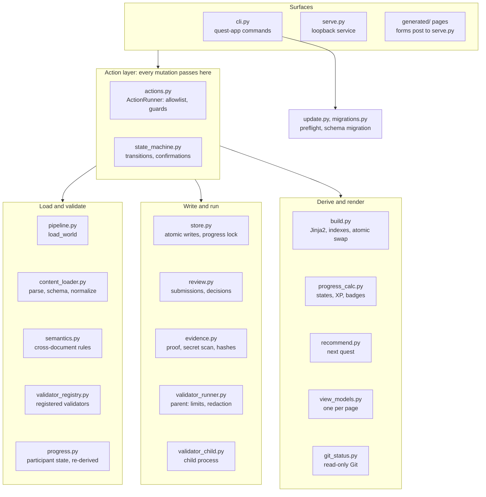

# Part 2. Architecture

This part names the components, explains what each one is responsible for, and says why it
is shaped that way. Part 4 then walks through the same components in motion.

## 2.1 Two halves: a generator and a small service

The application is a **hybrid** (ADR-008):

- **Static generation.** Python loads the content and the participant's state, validates
  both, computes every derived fact (which quests are locked, what XP is claimed or
  verified, which badges are earned), and renders HTML pages with Jinja2 into
  `generated/`. The pages are ordinary files: they open from disk with no server.
- **A loopback action service.** A small HTTP server on `127.0.0.1` serves those pages and
  accepts a short list of actions: start a quest, mark evidence ready, run a validator,
  submit, record a review, rebuild. After each action it rebuilds the site so the pages
  show the new state.

**Why this split.** Pure static HTML cannot create files, run checks or read Git, so some
process has to. A full dynamic web application would duplicate state between a server and a
browser and widen the attack surface. The hybrid keeps everything that is read as static,
deterministic output and everything that writes behind one narrow, checkable door.

A third surface, the **command line** (`quest-app`), calls the same action code directly.
It exists because the primary target surface, an agent sandbox such as the Cowork app, has a
filesystem but cannot reach a loopback port from the user's browser.

## 2.2 The components

**Walkthrough.** The figure groups modules by responsibility. Read it top to bottom.

1. **Surfaces.** Three entry points: the CLI (`cli.py`), the loopback service
   (`serve.py`), and the static pages themselves. The CLI and the service both call the
   **action layer**; neither holds any rule of its own about what a participant may do
   (ADR-033).
2. **Action layer.** `actions.py` holds `ActionRunner`, the single allowlist of mutating
   actions and every guard: prerequisites, confirmation, secret scan, qualifying validation.
   `state_machine.py` holds the transition table and the confirmation texts.
3. **Loading and validation.** `pipeline.load_world` is the one way to obtain a consistent
   picture of the world: it calls `content_loader.py` (discover, parse, schema-validate,
   normalize), `semantics.py` (cross-document rules), `validator_registry.py` (validator
   references), and `progress.py` (participant state, read but never believed).
4. **Derivation and presentation.** `progress_calc.py` computes states, XP and badges;
   `recommend.py` picks the next quest; `view_models.py` turns all of it into display-ready
   objects; `build.py` renders templates, writes indexes and publishes atomically.
5. **Writing and running.** `store.py` writes participant files atomically under a lock;
   `review.py` writes submission and review records; `evidence.py` detects proof, scans for
   secrets and hashes evidence; `validator_runner.py` runs a validator in a child process
   (`validator_child.py`).
6. **Repository tools.** `git_status.py` runs five read-only Git commands; `update.py` and
   `migrations.py` handle upstream updates.

*Figure 2. Components as implemented in `quest_app/`. Arrows run between groups: the action
layer calls into all three lower groups, and `build.py` writes the pages the surfaces serve. `docs/ARCHITECTURE.md` names a single
`progress_manager.py`; the code splits that role across `progress.py` (read),
`store.py` (write), `progress_calc.py` (derive), `state_machine.py` and `actions.py`.*

## 2.3 Content loading and JSON Schema validation

**What happens.** `content_loader.load_content` runs the same four steps every time:

1. **Discover** files under `content/` (quests are `content/quests/<region>/<name>.md`;
   regions, badges and tracks are YAML; `content/site.yaml` holds site identity). Only
   regular files inside the content tree are read, so a symbolic link to a device or a
   FIFO cannot hang the loader.
2. **Parse** YAML with a strict safe loader (`yaml_loader.StrictSafeLoader`): safe
   constructors only (ADR-025), duplicate keys refused (ADR-029), deep nesting reported as
   an ordinary problem.
3. **Validate** each document against its JSON Schema in `schemas/` using `jsonschema`
   Draft 2020-12 (ADR-005, ADR-020). There are ten schemas: quest, region, badge, track,
   site, progress, submission, review, validation-result and validator-registry.
4. **Normalize** each valid document into a frozen dataclass (`models.py`). Nothing
   downstream sees a raw dictionary. Quest Markdown is rendered with `markdown-it-py`,
   raw HTML disabled, then sanitized with `nh3` (ADR-021); the result is carried in a field
   named `safe_rendered_html` so it cannot be confused with plain text.

`semantics.validate_bundle` then applies the rules a schema cannot express, because they span
documents: duplicate IDs, unknown region, prerequisite, badge or related-quest references,
prerequisite cycles, a quest whose proof names a validator it does not declare, empty
regions, unreachable badges, and more. Some are errors that stop the build; others, such as
an unusual XP value for the chosen level, are warnings.

**Why schemas are the contract.** A JSON Schema is language-neutral, editor-friendly and
readable by a maintainer who does not read Python. A second model layer (for example
Pydantic) would restate the same rules in a place that can drift from the file the
maintainer reads (ADR-020).

**Why errors are shaped as they are.** Every failure is a `ContentProblem` naming the file,
the stable ID when known, the field path, the rule in words, a redacted received value, and a
suggestion (for a mistyped ID, the closest real one). The person fixing it is a curriculum
author in a text editor, not a developer reading a traceback.

**Acceptance criteria.** A quest's criteria are not duplicated into front matter. They are
read from the ordered list under the body's `## Acceptance criteria` heading, from the
Markdown token stream rather than by line matching (ADR-027), and each gets the positional ID
`ac-<n>` plus a hash of its text (ADR-016, amended by ADR-026). A reviewer's finding can then
point at `ac-3`, and the page and the finding agree on what `ac-3` means.

## 2.4 View models and Jinja2 rendering

**What happens.** `build.build_site` takes a `LoadedWorld` and:

1. computes per-quest state with `progress_calc.compute_states` (Part 3 explains the rule),
   region progress, claimed and verified totals, badge progress, and recommendations;
2. builds one view model per page in `view_models.py` (for example the quest summary, the
   evidence workspace, the reviewer view), each a display-ready object;
3. renders the thirteen page templates in `templates/pages/` with Jinja2, autoescaping on
   and `StrictUndefined` so a missing field is an error rather than an empty string;
4. writes search, tag, region, relationship and state indexes as JSON under
   `generated/indexes/`, plus `build-manifest.json` with the application version and the
   content hashes;
5. publishes the whole site atomically (Section 2.8).

The eleven screens specified in `docs/ui/SCREEN-SPECS.md` (U01 Home to U11 Content Author
Error) map to thirteen templates: the extra two are the tag page and the evidence index.

**Why view models.** Templates contain no quest-specific content and no logic that decides
anything (`docs/VIEW-MODEL-CONTRACT.md`). They do not open files, calculate progress,
resolve prerequisites or decide authority. That keeps one place, Python, responsible for
every rule, and lets a test assert that adding a quest leaves `templates/`, `assets/` and
`quest_app/` byte-identical.

**Why deterministic.** Traversals are sorted and JSON is written with sorted keys, so a diff
of `generated/` means content changed. The one varying value is the build time on each page.
Set `SOURCE_DATE_EPOCH` and two builds of the same inputs are byte-identical (ADR-040).

## 2.5 The loopback action service

**What it is.** `serve.py` runs `http.server.ThreadingHTTPServer` from the Python standard
library with an explicit route table (ADR-022). It serves `generated/` and exposes:

| Route | Method | Purpose |
|---|---|---|
| `/api/health` | GET | Application and service status |
| `/api/git-status` | GET | A summary from the five read-only Git commands |
| `/api/action` | POST, JSON body | Perform one allowlisted action |
| `/api/action/<action>/<quest-id>[/<validator-id>]` | POST, HTML form | The same, from a page with no JavaScript |
| anything else | GET | A static file from `generated/`, with the request token substituted into HTML |

**Why the standard library.** Every requirement on the service is a *restriction*: bind to
loopback, require a token, check origin, cap the body, accept only allowlisted IDs. A
framework adds dependencies and hides the exact request surface those restrictions apply to.
One local user needs no concurrency model beyond threads.

**The request token.** At startup the service mints a random token
(`secrets.token_urlsafe(32)`), keeps it in memory and never writes it to disk or prints it.
Built pages contain a placeholder; the service substitutes the token as it serves each HTML
page, so a form on a page this run served carries it. A page opened from disk, or served by
another run, does not have it, and its forms are refused.

**Which port is running.** The service writes the port it bound to a file per port under
`local-data/service-ports/` and removes it on shutdown (ADR-037). A CLI action or build
probes those ports, and believes an answer only if it carries this application's response
header and repository signature. It needs to know, because a rebuilt page says whether its
controls work: pages built while a service runs have live forms; pages built without one say
"Start the local service".

Part 5 lists every check a request meets. Part 4, flow 4.8, shows one request end to end.

## 2.6 The validator runner

**What a validator is.** A **validator** is a program-owned Python function that checks a
participant's artifacts and returns structured findings. Each is registered by stable ID in
`validators/registry.yaml` with an entrypoint (`validators.<module>:run`), a working
directory, read and write roots, an environment-variable allowlist, a timeout, an output
limit, the quests it may run for, and a `network: denied` declaration. A quest names a
validator by ID and can never supply a command, argument or path (ADR-014).

Release one registers three quest-facing validators (`validate-repository-foundation`,
`validate-jira-read-assigned`, `validate-playwright-quality`) and two environment probes used
by tests.

**How a run is isolated.** `validator_runner.run_validator`:

- starts a fresh interpreter as a child process with a fixed argument list and no shell,
  in its own session and process group (`start_new_session=True`);
- builds the child's environment from a minimal `PATH` plus the registry's allowlist, never
  inheriting the parent's environment, so an exported credential does not leak into a check;
- puts the repository first on the child's import path, so a `json.py` in the participant's
  folder cannot replace a standard module or the registered code;
- gives the validator a `Workspace` object whose read and write methods resolve symbolic
  links and re-check that the path is inside the registered roots, and that exposes the
  evidence package of *the attempt under validation* (ADR-039);
- reads output as it arrives, stops a run that writes more than 1 MiB on a stream, kills the
  whole process group on timeout, on exit, or a second after the child's result channel
  (its `stdout`) has closed while the OS process is still alive — a non-daemon thread the
  validator forgot to stop no longer costs the run its result (round 12, finding E11);
- redacts the complete output and every check field *before* truncating them, never after:
  cutting first can sever a secret-shaped token at the boundary, and the half that survives
  matches no detector (round 12, finding E7).

Every check a validator's process reports is also checked against the result schema's own
`id` pattern and `outcome` enum before it is trusted: a check outside either is replaced with
one reporting that a check was malformed, and the run's outcome is forced to
`environment_failure`, because a validator that cannot describe its own check correctly has a
defect in itself, not a fact about the participant's work — the same principle already
applied to an uncaught exception or a nonzero exit (round 12, finding E6).

**Outcomes.** A run ends in one of six outcomes: `pass`, `fail`, `warning`,
`environment_failure`, `inconclusive`, `interrupted`. Only `pass` and `warning` are
**qualifying** results. Part 4, flow 4.3, shows how each outcome is reached.

**A run is not a transition.** Running a validator appends a result file and changes nothing
else (ADR-017). The participant then asks for `locally_validated`, and that request succeeds
only if every declared validator's latest run qualifies. A validator is therefore a source of
facts, never an authority over the participant's state.

**What this is not.** The controls bound a validator through its `Workspace` and its process.
They are not an operating-system sandbox: `network: denied` is a declaration nothing
enforces, a validator calling `open()` directly bypasses the roots, and a grandchild that
starts its own session survives cleanup (`docs/VALIDATOR-CONTRACT.md`; deferred item D9).
Validators are program-owned code, reviewed like the rest of the application.

## 2.7 The progress store and locks

**The store.** `store.ProgressStore` is the only writer of `participant/progress.yaml`. Every
write:

1. validates the new document against `schemas/progress.schema.json` *before* writing, so
   the application never writes a file it would later refuse to load;
2. writes to a temporary file in the same directory, flushes and `fsync`s it, then renames it
   over the original (`atomic_write_text`, which calls `safe_io.atomic_write`). A rename
   within one filesystem is atomic, so an interrupted write leaves the old file intact;
3. appends a line to `participant/ACTIVITY.md` describing the change, so the participant can
   read everything the application did to their files.

**Every participant write follows the same rule, not just this one (ADR-042).** Round 12
found that the activity line was appended with a plain `open("a")`, which follows a symbolic
link wherever it leads and blocks forever on a FIFO; that validation results were written
into a `validation/` directory that could itself be a link out of the tree; and that the
review archive used a plain `write_text`. `safe_io.atomic_write` and
`safe_io.append_to_regular_file` now back every one of these: each walks from the participant
root one component at a time with `O_NOFOLLOW`, refuses a component that is a link or not a
directory, refuses a target that exists and is not a regular file, and never opens anything
in a way that can block. When the unusable target is `ACTIVITY.md`, the line is skipped and a
warning goes to stderr, because by the time it runs the change it describes is already on
disk in `progress.yaml`; refusing the action at that point, or reporting a failure that did
not happen, would cost the participant's trust in their own record for less reason than
skipping one note. For every other target — `progress.yaml`, a validation result, a
submission or review record — the write is refused before anything changes, like any other
write failure.

**Configuration, not just the participant root.** `GTQ_PARTICIPANT_ROOT`,
`GTQ_GENERATED_ROOT` and `GTQ_LOCAL_DATA_ROOT` are all read by `AppConfig.from_environment`,
and `_config_from_args` carries all three forward when `--participant-root` is passed on the
command line (ADR-018, amended round 12). Before the amendment, only the participant root
moved: a test that ran the CLI as a real subprocess — the only way an installed sandbox
participant can act at all — rebuilt the repository's own `generated/` on every mutating
action, overwriting a checked-in page with fixture data until the next `make build`. A
session-scoped test fixture (`tests/conftest.py`) now fails the whole run if the repository's
own `generated/`, `local-data/` or `participant/` changed anyway, as the backstop for a test
that forgets to set one of the three.

**Three locks.** Each one protects a different race:

| Lock | Where | Protects | Decision |
|---|---|---|---|
| Service lock | A `threading.Lock` in the service process | Two browser requests interleaving inside one service | `serve.py`; context in ADR-034 |
| Progress lock | `participant/.progress.lock`, an exclusive POSIX `flock`, held by `ActionRunner.perform` across load, decision and write | A CLI action and a service action (two processes) interleaving a read-modify-write | ADR-034 |
| Build lock | `generated.lock`, an exclusive `flock` held for the whole build | Two builds sharing the fixed staging directory `generated.building` | ADR-035 |

The progress lock is held across the *load* as well as the write, because reading state
another process is about to replace is the race. It is not held over the validator run,
which is slow and only appends.

**Why a lock failure never refuses the work.** Where a lock cannot be taken (no `fcntl`
module, an unopenable lock file, or a filesystem that answers `ENOLCK`, such as some network
home directories), the work proceeds unlocked (ADR-036). The atomic rename still guarantees
the file is never half-written, and refusing to record a participant's own work because of a
lock file is worse than the race.

**Why a failed rebuild does not fail the action.** An action writes its change, then
rebuilds. If the rebuild fails, the action is still reported as done, with an advisory that
the site could not be rebuilt (ADR-038). The participant's record cannot be regenerated; the
site can, by one command.

## 2.8 The build pipeline and last-known-good output

A build renders the entire site into a sibling directory, `generated.building`, and then
publishes by renaming: the current `generated/` becomes `generated.previous`, the staged
directory becomes `generated/`, and the previous copy is removed. Until that rename, a
reader keeps seeing the old site. If content fails validation, nothing is rendered into
`generated/` at all: the errors are written as a page to `local-data/build-errors/index.html`
and the last good site stays in place.

`docs/ARCHITECTURE.md` lists "copy fingerprinted or versioned static assets" as a build step.
The code copies `assets/` as-is; `routes.asset` accepts a fingerprint but no caller passes
one.

Part 4, flow 4.6, draws the pipeline.

## 2.9 The update and migration path

A participant's fork has two remotes: `origin` (their fork) and `upstream` (the canonical
repository). Taking new curriculum is a Git merge from `upstream`.

**The application never runs the merge.** `quest-app update` (also `make update-check`) is a
**preflight**: it checks that the directory is a Git repository, that no merge is in
progress, that the working tree is clean, that an `upstream` remote exists, and that the
participant folder is present. It reports whether a schema migration would be needed and
which attempts are on an older quest version, proposes a backup branch name, prints the exact
commands, and stops. Every Git command `update.py` may run is read-only.

**Migrations.** `quest-app update --migrate` (also `make migrate`) moves
`participant/progress.yaml` to the schema version this build reads. It runs under the progress
lock, validates before and after, reloads the whole world after writing, and restores the
original bytes if that reload fails. Two rules apply to every migration: an in-progress
attempt's quest version is never advanced, and an unknown field is carried forward rather than
dropped. Release one ships schema version 1, so the only step is the identity step; the
machinery exists so the safety is designed before the first real migration.

**Where this differs from the plan.** `docs/ARCHITECTURE.md` describes a future helper that
"may create a backup branch, merge or rebase, apply migrations". The code does none of the
Git writes: it names the branch and prints the commands (ADR-032, `update.py`). Part 4, flow
4.7, draws the sequence.
