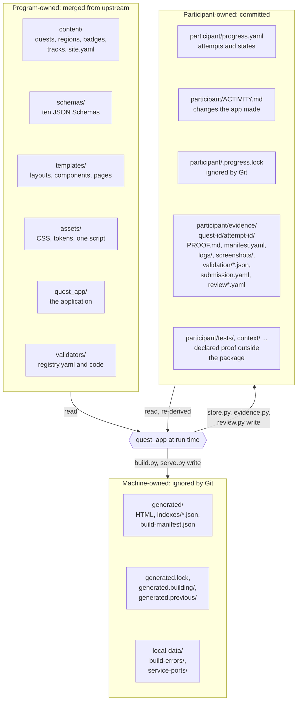
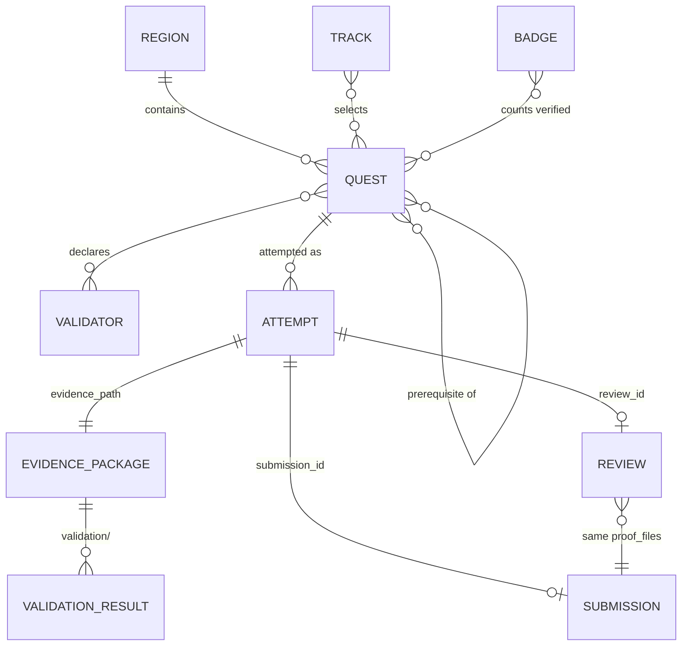
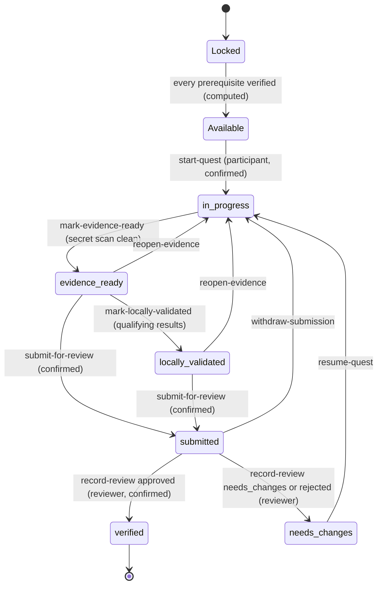

# Part 3. Data, identifiers and state

This part describes where each kind of record lives, how records refer to one another, and
the state machine an attempt moves through.

## 3.1 The repository folders and who owns them

**Walkthrough.**

1. The top-left group is **program-owned**. The curriculum maintainer and the application
   developers change it upstream, and it arrives in a fork by merge.
2. The top-right group is **participant-owned**. It does not exist in a fresh clone: the first
   `start-quest` action creates `participant/progress.yaml`, `participant/ACTIVITY.md` and the
   first evidence package. After that the participant owns it, commits it, and may edit it.
3. The bottom group is **machine-owned** and ignored by Git. Deleting it loses nothing that a
   build cannot recreate, except the error page of the last failed build and the port files
   of running services.
4. The arrows show the only read and write paths. The application writes into `participant/` only
   through the store, the evidence code and the review code, and only inside the configured
   participant root after symbolic links are resolved (ADR-018).

*Figure 3. Repository folders by owner, from the code (`store.py`, `review.py`, `build.py`,
`.gitignore`).*

**Where this differs from the plan.** `docs/ARCHITECTURE.md` lists participant files the
application does not create or read: `PROFILE.md`, `QUEST-PASSPORT.md`, `QUEST-LOG.md`,
`skills/`, `scripts/`. The passport is a generated page, not a participant file. The code
creates only what the figure shows; a quest may ask the participant to create other folders,
such as `participant/tests/`, as proof.

## 3.2 Records and what each one holds

| Record | Format and location | Written by | Holds |
|---|---|---|---|
| Quest | Markdown with YAML front matter, `content/quests/<region>/<name>.md` | Maintainer | `id`, `version`, `title`, `summary`, `region`, `level`, `xp`, `estimated_minutes`, `tags`, `outcomes`, `proof` (required and optional), optional `prerequisites`, `validators`, `related_quests`, `risk`; the body holds Mission, Scenario, Acceptance criteria, Required evidence, Safety constraints, Hints, Reflection |
| Region, badge, track, site | YAML under `content/` | Maintainer | Ordering and outcomes (region), criteria and authority (badge), quest selection (track), identity and navigation (site) |
| Validator registry | `validators/registry.yaml` | Program | Every program that may run, with its constraints (Section 2.6) |
| Progress | `participant/progress.yaml` | Application, and the participant by hand | Participant identity, selected track, focus tags, and one entry per **attempt**: `attempt_id`, `quest_id`, `quest_version`, `content_hash`, `state`, timestamps, `evidence_path`, `submission_id`, `review_id` |
| Evidence package | `participant/evidence/<quest-id>/<attempt-id>/` | Participant (content), application (template) | `PROOF.md` answering what was built, where, how to reproduce, what was checked, what remains, and a sensitive-values confirmation; `manifest.yaml`; `logs/`, `screenshots/` |
| Validation result | JSON, `validation/<run-id>.json` inside the package | Validator runner | Run ID, validator ID and version, quest and attempt IDs, timestamps, outcome, checks, redacted output excerpt |
| Submission | `submission.yaml` inside the package | Application, on submit | Submission ID, quest version, attempt ID, content hash, **evidence hash**, **proof_files** digests, secret-scan result, validation run IDs, advisories |
| Review | `review.yaml` inside the package; superseded decisions archived as `review-<timestamp>.yaml` | Application, on the reviewer's decision | Review ID, quest ID and version, attempt ID, evidence hash, reviewer display name, decision, findings, verification statement (for approval), proof_files |
| Activity log | `participant/ACTIVITY.md` | Application | One line per change the application made |
| Generated site | `generated/` | Build | HTML pages, JSON indexes, build manifest. Never authoritative |

Every participant-side record is validated against its schema before it is written and again
when it is read.

## 3.3 Stable identifiers

Records refer to each other by **stable ID**, never by filename or title (ADR-012). An ID is
lowercase ASCII letters, digits and hyphens, starts with a letter, is unique within its type,
and is never reused for a different concept. Examples: `base-camp-repository-safety` (quest),
`jira-jungle` (region), `validate-jira-read-assigned` (validator).

IDs the application mints:

| ID | Shape | Example |
|---|---|---|
| Attempt | `<first word of quest id>-attempt-<nnn>` | `base-attempt-001` |
| Submission | `submission-<UTC timestamp>-<6 hex>` | `submission-20260924142343-ca18d5` |
| Review | `review-<UTC timestamp>-<6 hex>` | `review-20260924142355-1a2b3c` |
| Acceptance criterion | `ac-<n>`, by position in the list | `ac-3` |

**Why IDs and not paths.** Titles and filenames change. A reviewer's finding on `ac-3`, an
attempt's `quest_id`, a badge's list of quests all survive a rename. URLs are derived from IDs
by `routes.py`; content never stores an output path. Records are also connected by ID and
never by modification time: a validator judges the package of the attempt it was given, not
the newest file under `participant/evidence` (ADR-039).

*Figure 4. How records reference one another by stable ID. Program-owned records (region,
track, badge, quest, validator) are on the left of each relation; participant-owned records
(attempt and everything under it) on the right.*

## 3.4 Versions and hashes

Three fingerprints let the application notice change without trusting anyone's word.

- **Quest version** (`version`, a positive integer) is declared by the author and must be
  raised when outcomes, criteria, proof, validators, XP, prerequisites or safety rules
  change. An attempt records the version it started on and keeps it through an update.
- **Content hash** (`content_hash`) is a SHA-256 over the quest's front matter and body. An
  attempt records it at start. A mismatch later is a **warning**, never an error: "the text
  changed since you started", or for a verified attempt "the approval may be stale"
  (ADR-028). It is a warning because the hash also changes on a typo fix, and a typo fix
  must not revoke someone's approved work.
- **Evidence hash** (`evidence_hash`) is a SHA-256 over the evidence package, excluding
  `validation/`, `submission.yaml` and `review*.yaml` (ADR-031). It answers "has the
  participant's work changed?", so the application's own bookkeeping stays out of it.
  Because most quests declare proof outside the package, submissions and reviews also record
  **proof_files**: a digest per declared proof path outside the package, `missing` when
  nothing is there and `unresolvable` when the path leads outside `participant/`
  (ADR-031, amended in round 11).

The submission records both fingerprints. The reviewer's approval is refused if either has
changed since submission unless the reviewer acknowledges the change, and after approval the
loader warns if the package or any proof file changes.

## 3.5 The attempt state machine

**Terms.** A **quest state** is what the pages show for a quest. Two quest states are
*computed* and never stored: **locked** (a prerequisite is not yet verified) and
**available** (every prerequisite is verified, no attempt exists). The other six are
**attempt states**, stored in `progress.yaml`: `in_progress`, `evidence_ready`,
`locally_validated`, `submitted`, `needs_changes`, `verified`. A prerequisite counts as met
only when it is *verified*, not merely attempted.

**Walkthrough.**

1. `start-quest` creates the attempt and its evidence package, and moves the quest from
   available to `in_progress`. It is refused on a locked quest, and it needs a confirmation.
2. `mark-evidence-ready` is the participant's assertion that the proof is assembled. It is
   refused if the secret scan finds anything in the evidence package.
3. `mark-locally-validated` is refused unless every validator the quest declares has a
   qualifying latest result. A quest with no validators reaches it on the participant's word.
   Running a validator is **not** a transition.
4. `submit-for-review` works from `evidence_ready` or `locally_validated`. Unrun or failing
   validators become advisories on the submission, not blockers. A secret-scan hit, a link
   leading outside the package, or a missing package blocks it. It needs a confirmation.
5. `reopen-evidence` and `withdraw-submission` let the participant step back to
   `in_progress`.
6. The reviewer's `record-review` moves `submitted` to `verified` (approved) or to
   `needs_changes` (needs changes, or rejected). It needs a confirmation. `resume-quest`
   takes the participant from `needs_changes` back to `in_progress`.
7. `verified` has no outgoing transition.

*Figure 5. The attempt state machine as implemented in `quest_app/state_machine.py`
(participant transitions) and `quest_app/review.py` (reviewer transitions). Locked and
Available are computed in `progress_calc.py` and never written.*

### The rule that only a reviewer produces verified

Nothing in the transition table can produce `verified`. The one line of code that writes it
is `review._apply_decision`, and it runs only after `record_decision` has checked that the
attempt is `submitted`, that an approval carries a verification statement of at least twenty
characters, and that the evidence has not changed since submission (or that the reviewer
acknowledged the change).

Because `progress.yaml` is the participant's file, writing `state: verified` by hand is
possible. The loader therefore re-derives `verified` on every load and refuses it, as the
integrity error `progress.unverified_verified_state`, when the attempt names no review, the
review is missing, belongs to another attempt or quest, is not an approval, has no
verification statement, or approves a different quest version. The same applies to a
hand-written `locally_validated` without a qualifying result for each declared validator
(`progress.unvalidated_locally_validated_state`, ADR-017 amended in round 11).

Verified XP and badges are computed only from attempts that pass this check. Claimed XP
counts `evidence_ready` and every later state.

### Where the code and the specification disagree

`docs/ARCHITECTURE.md` draws a different machine. The code is authoritative; each difference
is deliberate unless marked open.

| Specification | Code | Reason |
|---|---|---|
| `EvidenceReady --> InProgress: Validation fails` | No such edge. A failing run leaves the state alone | ADR-017: a validator is not an authority over participant state |
| Submission only from `LocallyValidated` | Submission also from `evidence_ready`, with unrun or failing validators carried as advisories | `review.readiness_problems`; the specification's own note allows submission with advisory failures if displayed |
| No step back from evidence-ready or submitted | `reopen-evidence` and `withdraw-submission` | Participant can correct work before a reviewer decides |
| Decision `rejected` (`CONTENT-MODEL.md`) with no state of its own | `rejected` maps to the `needs_changes` state | `review._apply_decision` |
| Spelling `needs-changes` (`CONTENT-MODEL.md`) | `needs_changes` everywhere | `models.Decision`, `models.AttemptState` |
| A `submitted` attempt always has a submission | A hand-edited `submitted` with no `submission.yaml` loads and can be approved, skipping the secret-scan gate | **Open**: round 12 finding E4 (Medium) |
| A legitimate `locally_validated` attempt survives an update | It becomes a load error when an update adds a validator to the quest, because the check reads the current quest's validators, not the attempt's version | **Open**: round 12 finding E5 (High) |
