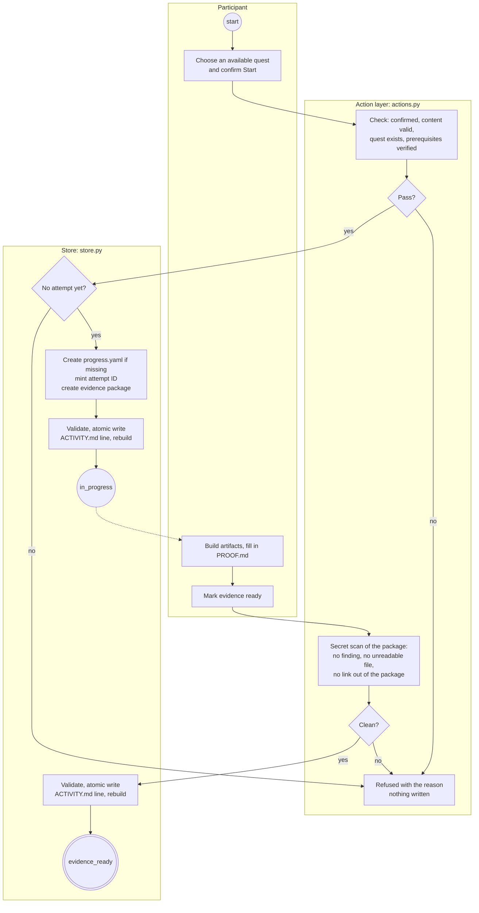
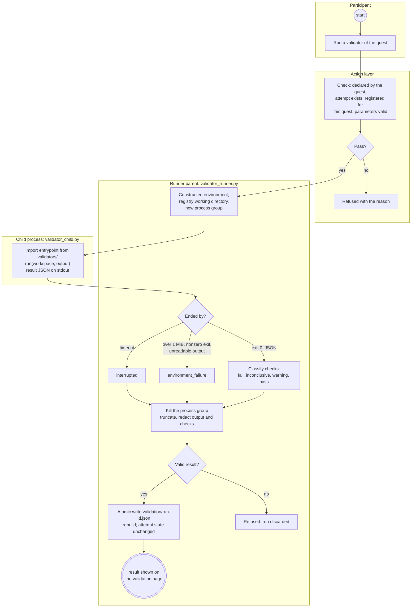
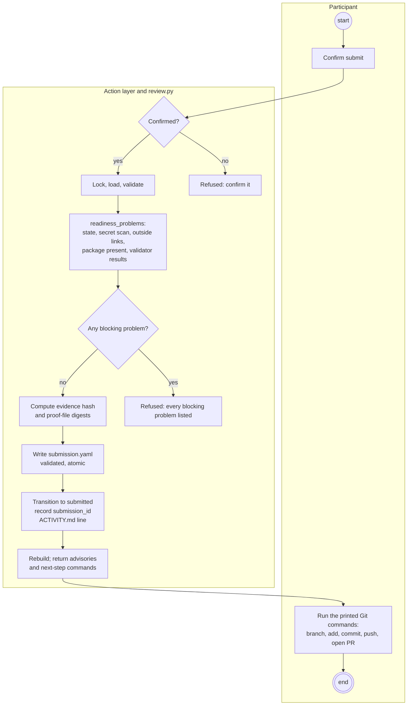
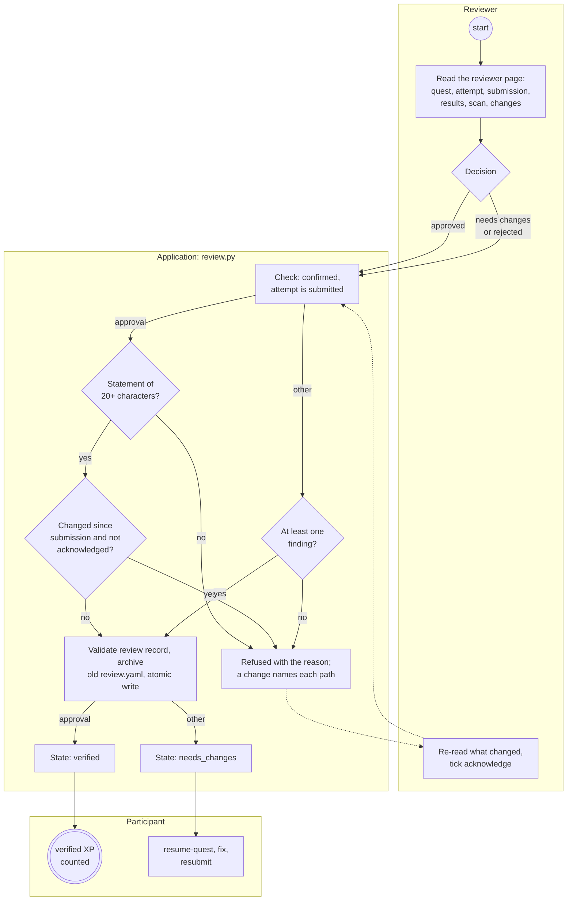
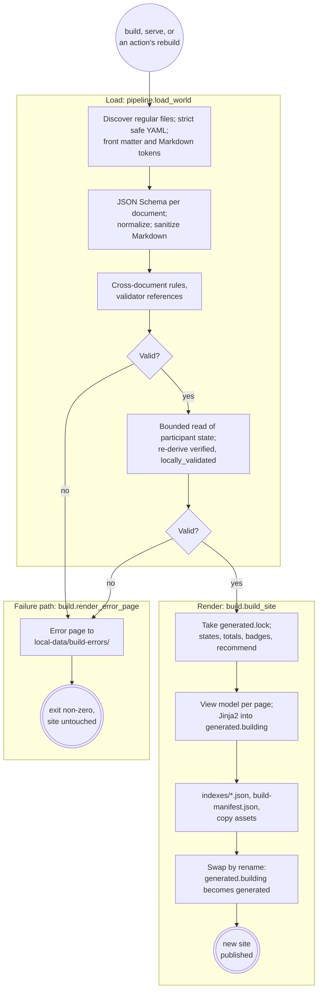
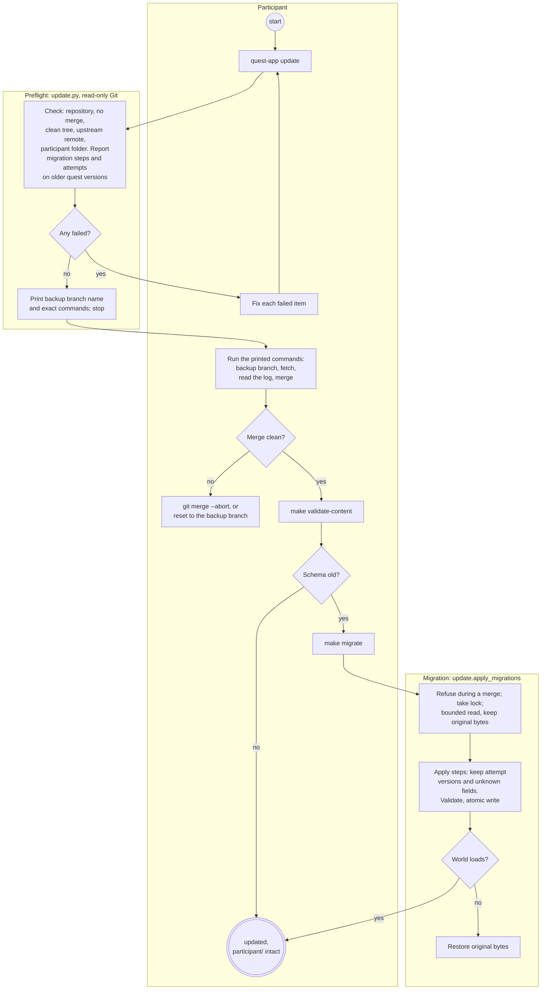
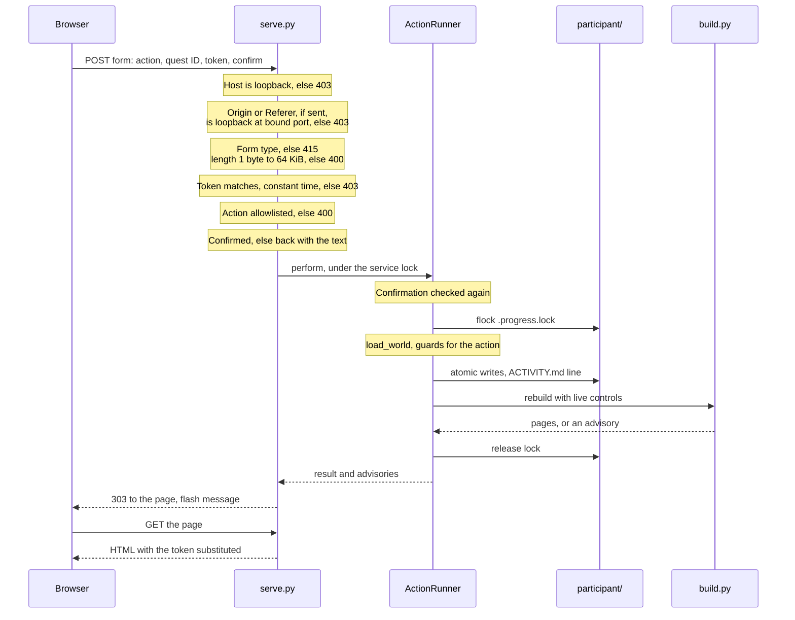

# Part 4. The system in motion

This part walks through the main flows. Each diagram is drawn from the code, and each flow
names the functions that implement it so a reader can check.

## 4.1 How to read these diagrams

The activity diagrams are UML-style, drawn as Mermaid flowcharts:

- a **lane** (a labelled box) groups the steps one role or one process performs;
- a rounded box is an action; a diamond is a decision; a circle marks the start; a double
  circle marks the end;
- a box whose text begins **Refused** is a place the flow stops with a message and changes
  nothing.

Every mutating action in these flows passes through `ActionRunner.perform`
(`quest_app/actions.py`), whichever surface asked. It performs three steps before the action
itself: it refuses `start-quest`, `submit-for-review` and `record-review` without a
confirmation; it takes the progress lock; and it loads and validates the whole world
(`pipeline.load_world`). If content or participant state does not validate, every action is
refused. The diagrams show these steps once, in flow 4.2, and abbreviate them after that.

The commands in this part are the command-line equivalent of the browser controls. Run them
from the repository root with the virtual environment active (`source .venv/bin/activate`).

## 4.2 A participant starts a quest and assembles evidence

**Walkthrough.**

1. The participant chooses an available quest and confirms "Start this quest and create an
   evidence package in my repository".
2. The action layer checks the confirmation, takes the progress lock, and loads the world.
   It refuses a quest ID that is not in the loaded content, so no caller-supplied string
   ever reaches the filesystem as a path.
3. It refuses a locked quest: every prerequisite must be *verified* (ADR-033). This check is
   in the action layer, not only in the page, so the CLI cannot bypass it.
4. `store.start_attempt` creates `progress.yaml` if this is the participant's first action,
   refuses if the quest already has an attempt, mints the attempt ID, and creates the
   evidence package from a template: `PROOF.md` with its six headings, `manifest.yaml`, and
   empty `validation/`, `screenshots/` and `logs/` folders. Existing files are never
   overwritten.
5. It appends the attempt (quest version and content hash included), validates the new
   `progress.yaml` against its schema, writes it atomically, and appends a line to
   `ACTIVITY.md`.
6. The site is rebuilt. A failed rebuild becomes an advisory; the attempt is still recorded
   (ADR-038).
7. The participant does the work in their own editor and tools: artifacts under
   `participant/`, and `PROOF.md` filled in.
8. `mark-evidence-ready` runs the secret scan over the whole package. Any finding, any file
   the scan cannot read, and any symbolic link leading outside the package blocks it. The
   message names the file and line, never the value.

```bash
quest-app action start-quest --quest base-camp-repository-safety --confirm
quest-app action mark-evidence-ready --quest base-camp-repository-safety
```



*Figure 6. Starting a quest and marking evidence ready (`ActionRunner._perform`,
`store.start_attempt`, `ActionRunner._require_clean_secret_scan`). Marking evidence ready
needs no confirmation, but it takes the lock and loads the world like every action.*

## 4.3 Running a validator

**Walkthrough.**

1. The participant runs one of the quest's validators. The action layer refuses a validator
   the quest does not declare, and a quest with no attempt.
2. The registry entry is looked up by ID. `run_validator` refuses a validator not
   registered for this quest, and binds parameters against their declared types and allowed
   values; there is deliberately no free-text parameter type.
3. The runner builds the child's environment from a minimal `PATH` plus the registry
   allowlist, sets the working directory from the registry, and starts
   `python -s -c <bootstrap>` in a new session and process group. The specification (roots,
   parameters, the attempt's evidence root) is sent on standard input. There is no shell and
   no argument built from input.
4. The child imports the entrypoint, but only from the `validators` package, and calls it
   with a `Workspace` and an output collector. The validator's own prints are moved to
   standard error so they cannot corrupt the result, which is written as JSON on the
   original standard output.
5. The parent reads both streams as they arrive. Four things can end the run: the child
   exits; the timeout passes; a stream exceeds 1 MiB; or the child exits and one second
   passes while grandchildren still hold a pipe. In every case the whole process group is
   killed.
6. The run is classified (next table). Every result carries at least one check, so an
   `interrupted` or `environment_failure` run still tells the participant what happened.
7. Output is truncated to the registered limit (at most 20,000 characters), redacted, and
   every free-text field of every check is redacted.
8. The result is validated against `validation-result.schema.json` and written atomically to
   `validation/<run-id>.json` in the attempt's package. The site is rebuilt. **The attempt's
   state does not change.**
9. Later, `mark-locally-validated` succeeds only if every declared validator's latest result
   is `pass` or `warning`.

| Outcome | How it is reached (`validator_runner.py`) | Qualifies? |
|---|---|---|
| `interrupted` | The timeout passed | No |
| `environment_failure` | Output over 1 MiB; nonzero exit; empty output; unreadable JSON; the validator raised; the validator tried to leave its roots; or it reported an environment failure itself | No |
| `inconclusive` | No checks, every check skipped, or any check inconclusive (and none failed) | No |
| `fail` | Any check failed | No |
| `warning` | Any check warned, none failed or were inconclusive | Yes |
| `pass` | Every check passed | Yes |

```bash
quest-app action run-validator --quest base-camp-repository-safety \
  --validator validate-repository-foundation
quest-app action mark-locally-validated --quest base-camp-repository-safety
```



*Figure 7. Running a validator (`ActionRunner._run_validator`, `run_validator`, `_collect`,
`classify`, `validator_child.main`, `evidence.store_result`).*

**Open issues in this flow (round 12).** An oversize `summary`, `evidence` or other check
field is not capped, so the schema check refuses the whole run instead of recording it (E6,
Medium). Redaction runs after truncation, so a token cut at the boundary can be stored in
clear (E7, Medium). A validator that finishes but leaves a non-daemon thread running is
reported `interrupted` (E11, Low). A grandchild that starts its own session survives cleanup
(E9, Low).

## 4.4 Submitting for review

**Walkthrough.**

1. The participant confirms "Submit this evidence for review. A reviewer will read it".
2. `review.readiness_problems` collects every problem at once, so the participant sees all
   of them together. **Blocking** problems: the attempt is not `evidence_ready` or
   `locally_validated`; the secret scan found something; a link leads outside the package;
   the package is missing. **Advisory** problems: a declared validator has not been run, or
   its latest result does not qualify.
3. Any blocking problem refuses the submission.
4. Otherwise `create_submission` computes the evidence hash and the proof-file digests,
   writes `submission.yaml` (validated against its schema) into the package, moves the
   attempt to `submitted`, records the submission ID on the attempt, and appends an activity
   line.
5. The site is rebuilt, and the result carries the advisories and the Git commands for the
   next step.
6. **The application never pushes, opens a pull request or merges** (ADR-032). It prints the
   commands: create a branch, add the evidence and `progress.yaml`, commit, push, open a pull
   request. The participant runs them. Pushing is a claim, on the participant's behalf, that
   the work is ready, and that claim is theirs to make.

```bash
quest-app action submit-for-review --quest base-camp-repository-safety --confirm
```



*Figure 8. Submitting for review (`ActionRunner._submit`, `review.create_submission`,
`review.readiness_problems`, `review.submission_instructions`).*

## 4.5 The reviewer's decision

**Walkthrough.**

1. The reviewer reads the evidence: the reviewer page (`/review/<quest-id>/`) shows the
   quest and its version, the attempt, the submission, the validator results, the secret-scan
   result, and whether anything changed since submission, naming each changed path.
2. The reviewer chooses **approved**, **needs changes** or **rejected**, fills in the form,
   and confirms. The confirmation text depends on the decision; only the approval text says
   it produces verified XP.
3. `record_decision` refuses a decision that is not one of the three values, and an attempt
   that is not `submitted`.
4. An **approval** needs a verification statement of at least twenty characters saying what
   was checked and how. Then the **changed-since-submission gate**: the current evidence hash
   and each recorded proof-file digest are compared with `submission.yaml`. If anything
   differs, the approval is refused unless the reviewer acknowledges the change. Approving
   changed evidence would approve something the reviewer has not seen.
5. **Needs changes** and **rejected** need at least one finding with a severity, a summary
   and the evidence observed.
6. The review record is validated against its schema. An existing `review.yaml` is archived
   as `review-<timestamp>.yaml` rather than overwritten, so a change of mind stays visible.
   The new record is written atomically.
7. `_apply_decision` sets the attempt state: `verified` for an approval, `needs_changes`
   otherwise. This is the only code that writes `verified`.
8. The site is rebuilt. On the next load, `verified` is re-derived from this record
   (Part 3, Section 3.5), and verified XP and badges follow from it.
9. After `needs_changes`, the participant runs `resume-quest` and the cycle repeats.

```bash
quest-app action record-review --quest base-camp-repository-safety \
  --decision approved \
  --reviewer "Your Name" \
  --statement "What you checked and how, in your own words." \
  --confirm

quest-app action record-review --quest base-camp-repository-safety \
  --decision needs_changes \
  --reviewer "Your Name" \
  --finding "high:What is wrong:Where you saw it" \
  --confirm
```

Add `--acknowledge-changed-evidence` to approve evidence that changed after submission; the
browser form has the same checkbox.



*Figure 9. Recording a reviewer decision (`ActionRunner._record_review`,
`review.record_decision`, `review.changes_since_submission`, `review._apply_decision`).*

**Provenance.** A reviewer is identified by the display name in the record and by Git
history. Records are not signed (ADR-030). The application refuses every internally
inconsistent claim, but a participant with write access to their own repository could write
a record naming someone else. Programs that need more should review through pull requests so
Git carries the identity. Release one also has no role separation: a participant can open the
reviewer page for their own work (deferred item D11).

## 4.6 The build and render pipeline

**Walkthrough.**

1. `quest-app build` (also `make build`), `quest-app serve`, and every action's rebuild all
   call the same pipeline.
2. `load_world` loads content first: discover, parse strictly, validate against schemas,
   normalize, then apply cross-document rules and check validator references. Participant
   state is read only if content is valid, because an attempt cannot be judged against a
   curriculum that does not make sense. A missing `progress.yaml` is normal.
3. Participant state is read with bounded reads: each file must be an ordinary file under a
   size ceiling. `verified` and `locally_validated` claims are checked against their records.
4. **If anything is an error**, the build renders the error page (U11) to
   `local-data/build-errors/index.html`, prints its path, exits non-zero, and leaves the
   published site untouched.
5. **If valid**, `build_site` takes the build lock and renders into `generated.building`:
   derived states, totals, badges and recommendations; one view model per page; every page
   through Jinja2 with autoescaping; the JSON indexes and the manifest; a copy of `assets/`.
6. The publish is two renames. Only then does a reader see the new site.

```bash
make validate-content
make build
```



*Figure 10. The build pipeline (`pipeline.load_world`, `content_loader.load_content`,
`build.build_site`, `build._swap`, `build.render_error_page`).*

**Open issues in this flow (round 12).** Validation result files and `review*.yaml` files are
read without the size bound that protects `progress.yaml`, so a FIFO or a link to a device
can hang or kill a build (E2, E3, High). Evidence files have no size ceiling, so a very large
log slows every build (E8, Medium).

## 4.7 Taking an upstream curriculum update

**Walkthrough.**

1. The participant runs the preflight. It checks: a Git repository; no merge in progress
   (checked first, because the working-tree advice would otherwise be to commit conflict
   markers); a clean working tree; an `upstream` remote; the participant folder. Each is
   `pass`, `warning` or `fail`.
2. It reports what a migration would do and which attempts are on an older quest version
   than upstream now publishes. Those attempts are not moved.
3. If anything fails, it prints the fix for each and exits non-zero. Otherwise it prints a
   backup branch name and the commands, and stops. It runs no merge and creates no branch.
4. The participant runs the printed commands: create the backup branch, fetch, read the
   incoming log, merge. Because curriculum and participant work are in separate folders, the
   merge touches only program-owned files unless both sides edited the same file.
5. The participant runs `make validate-content`. If it reports that the progress schema is
   old, they run `make migrate`.
6. The migration refuses during a merge, takes the progress lock, reads the file with a
   bounded read, applies each step (never advancing an in-progress attempt's quest version,
   never dropping an unknown field), validates, writes atomically, reloads the whole world,
   and restores the original bytes if the reload fails.
7. If the merge goes wrong: `git merge --abort`, or reset to the backup branch.

```bash
quest-app update
make update-check
make migrate
```



*Figure 11. Taking an upstream update (`update.preflight`, `update.update_instructions`,
`update.apply_migrations`, `migrations.migrate`). The flow starts at `start` in the
Participant lane.*

**Open issues in this flow (round 12).** A `locally_validated` attempt becomes a load error
after an update that adds a validator to its quest, and every action is then refused (E5,
High). `make migrate` rewrites `progress.yaml` without an activity line (E10, Low).

## 4.8 One browser action through the loopback service

**Walkthrough.** The participant presses a button on a served page, for example Submit on the
quest page. The page is an ordinary HTML form; no JavaScript is needed.

1. The browser posts `application/x-www-form-urlencoded` to
   `/api/action/submit-for-review/<quest-id>`. The form carries the per-run token, which the
   service substituted into the page when it served it, and the confirmation checkbox.
2. **Host check.** A `Host` header that is not a loopback name is refused, which defeats DNS
   rebinding (ADR-041).
3. **Origin check.** If `Origin` or `Referer` is present, it must be `http` on a loopback
   name at the bound port.
4. **Body.** The content type must be the form type and the declared length at most 64 KiB,
   checked before the body is read.
5. **Token.** Compared in constant time with the token in memory.
6. **Allowlist.** The action must be in `MUTATING_ACTIONS`; the path carries only IDs.
7. **Confirmation.** A confirmed action without the checkbox is sent back to the page with the
   confirmation text. `ActionRunner.perform` checks the same rule again, so the JSON endpoint
   and the CLI meet it too (ADR-033).
8. **Locks.** The service lock serializes requests in this process; the progress lock
   serializes against a CLI action in another process.
9. **Load, guards, write.** The action layer loads the world, applies the action's guards,
   and writes records atomically.
10. **Rebuild.** The site is rebuilt with live controls, because the service is running.
11. The service answers `303 See Other` back to the page, with a flash message for a refusal
    or an advisory. Every failure path answers with a status and a message; none escapes as a
    traceback.



*Figure 12. A form action through the loopback service (`serve.Handler._post`,
`_handle_form_action`, `_host_is_acceptable`, `_origin_is_acceptable`, `_read_form_body`,
`_token_matches`, `ActionRunner.perform`).*

**Open issue: this flow does not work in a real browser at `16a0b03`.** Round 12 finding C1
(Blocking): every page is served with `Referrer-Policy: no-referrer`, so Chromium sends
`Origin: null` on a form post. `_origin_is_acceptable` parses `null` as a non-`http` origin
and refuses the request as cross-origin at step 3. Only the CLI can change state at this
commit. No test submitted a form end to end. A fix is in progress on `fix/r12-web` and is not
merged.
