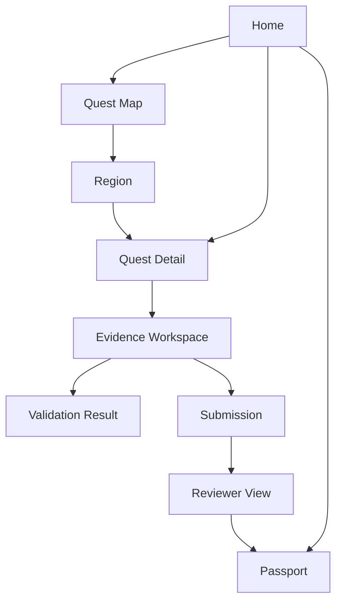

# UI Specification

## Product shell

The application uses a consistent shell with:

- a skip link;
- left navigation on wide screens;
- compact top bar on narrow screens;
- page title, description, and relevant status;
- main content region;
- optional contextual rail;
- build and repository status in the footer or utility area.

Primary navigation:

1. Home
2. Quest Map
3. Catalog
4. Evidence
5. Passport
6. Environment
7. Reviewer

Reviewer may be hidden or disabled when reviewer mode is not configured, but its route and component contract should remain supported.

## Information architecture

## Page layout patterns

### Dashboard

Used by Home and Passport.

- Introductory heading
- Primary summary or hero panel
- Grid of summary cards
- Recent or recommended activity
- Secondary details below

### Catalog

Used by Quest Map, Region, and Catalog.

- Heading and aggregate progress
- Search and filter controls
- Responsive card/list content
- Empty-results explanation

### Workbench

Used by Quest Detail and Evidence Workspace.

- Main task content
- Contextual rail with status and actions
- Progressive disclosure for long detail
- Sticky action summary on wide screens only when it does not obscure content

### Review

Used by Reviewer View and detailed validation.

- Identity and version header
- Evidence checklist
- Findings and validator results
- Review form and decision controls
- Audit trail

## Global progress language

Use these user-facing labels consistently:

| Internal state | UI label | Authority |
|---|---|---|
| `locked` | Locked | System prerequisite calculation |
| `available` | Available | System prerequisite calculation |
| `in_progress` | In progress | Participant action |
| `evidence_ready` | Evidence ready | Participant action |
| `locally_validated` | Locally validated | Registered validators |
| `submitted` | Submitted for review | Participant action |
| `needs_changes` | Needs changes | Reviewer decision |
| `verified` | Verified | Reviewer approval |

Do not shorten `locally_validated` to “verified.”

## Primary navigation behavior

- Current destination is visibly and programmatically marked.
- Navigation retains participant progress summary but does not crowd individual links.
- On narrow screens, a menu button controls an accessible navigation drawer.
- Escape closes the drawer and returns focus to the menu button.
- Navigation state is not required to use JavaScript on wide screens.

## Search and filtering

Catalog filters include:

- region;
- state;
- difficulty;
- tags;
- estimated time;
- read-only versus external-write risk;
- intent, validation, or cross-bookend focus.

Search matches normalized title, summary, outcomes, tags, region, and tool names. It must not search raw participant evidence from a public catalog page.

Active filters appear as removable chips and can be reset together. The URL should preserve filter state where practical.

## Recommended-next presentation

The home page presents one primary recommendation and up to three alternatives.

The primary recommendation includes:

- quest title and region;
- estimated time and XP;
- current availability;
- three concise reasons it was recommended;
- “Continue” or “View quest” action;
- a link to see alternatives or adjust focus.

The recommendation must be deterministic and explainable. Do not present it as an opaque AI decision.

## Quest detail behavior

Quest detail separates:

- what the participant is trying to achieve;
- how success is judged;
- what proof is required;
- how to work safely;
- what is optional.

The page must not turn long acceptance criteria into tiny sidebar text. The main narrative remains readable at a comfortable line length.

The action rail contains:

- state;
- quest version;
- XP and difficulty;
- time estimate;
- prerequisites;
- primary allowed action;
- content update notice when applicable.

## Evidence workspace behavior

The workspace shows required evidence as independently addressable items.

Each item shows:

- requirement;
- expected artifact or behavior;
- current detection state;
- validator relationship;
- participant note where supported;
- last checked time.

Running validation opens or navigates to a result summary containing:

- overall outcome;
- environment information;
- duration;
- passed checks;
- actionable failures;
- warnings;
- truncated/redacted output;
- complete local result path;
- rerun action.

## Passport behavior

The passport is a professional portfolio summary, not merely a score screen.

It contains:

- participant profile;
- claimed XP and verified XP;
- region progress;
- earned and pending badges;
- verified capabilities;
- recent quest history;
- areas recommended for breadth;
- exportable sanitized public-progress preview.

Badges state whether they are automatic, reviewer-awarded, or program-awarded.

## Reviewer behavior

Reviewer View is intentionally evidence-dense.

It must identify:

- participant;
- quest and quest version;
- attempt ID;
- evidence content hash or status;
- local validation status;
- artifacts and reproduction instructions;
- existing findings;
- changed evidence since last review.

Decision controls are visually separated from navigation. Approval requires an explicit verification statement. “Needs changes” requires at least one finding.

## Notifications

- Use inline alerts for information tied to a page section.
- Use brief status announcements for successful background actions.
- Important errors persist until resolved or dismissed.
- Never rely solely on transient toast notifications for failure or review decisions.
- Screen readers receive polite announcements for ordinary completion and assertive announcements only for urgent failure.

## Loading and no-JavaScript behavior

Generated pages render meaningful core content without JavaScript. JavaScript may enhance filtering, disclosures, navigation, and service actions.

When the local service is unavailable:

- content remains browsable;
- state-changing controls are disabled with explanation;
- CLI alternatives are shown where available;
- the page does not pretend an action succeeded.

## Prototype mapping

`prototype/index.html` demonstrates all major screen types using hash navigation and `prototype/data/prototype-data.js`. It intentionally keeps fixture content outside the HTML to model the final separation.
